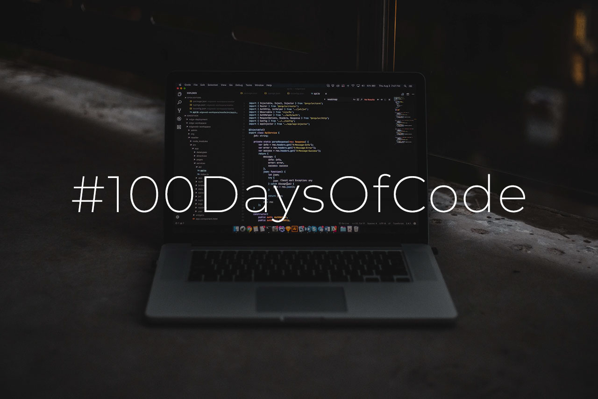

# 100-Days-Of-Code

This is my repository for "100 Days of Code" Challenge where I will be primarily working with Machine Learning Codes

As part of this Challenge, I will code for atleast 1 Hour per day and log my progress in seperate folders to account for myself. I will also be encouraging others to take up Coding daily and pick up the challenge after they have familiarized themselves with the concept.

Daily log to track my progress on the 100 days of ML code challenge.

### Day 1 (29-06-2021) : Naive Bayes
- Started with the [intro to machine learning](https://www.udacity.com/course/intro-to-machine-learning--ud120)  course on Udacity 
- Learnt the basics of a Naive Bayes classifier on the `iris` dataset
- Working on classifying the `Stanley Terrain` dataset and graph the decision surface

### Day 2 (30-06-2021) : Naive Bayes mini-project
- Working on the Naive Bayes mini-project to classify email.
- Tried really hard to make the python 2.7 code compatible with 3.6 and learnt about `dos2unix` and pickling of data. 
- Completed the Naive Bayes project with accuracy of 90.24% (Need to improve it!)
